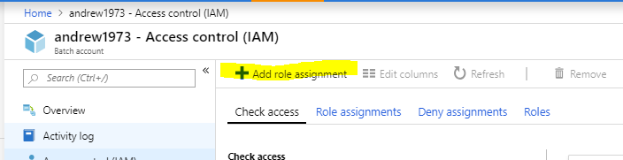
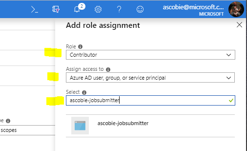
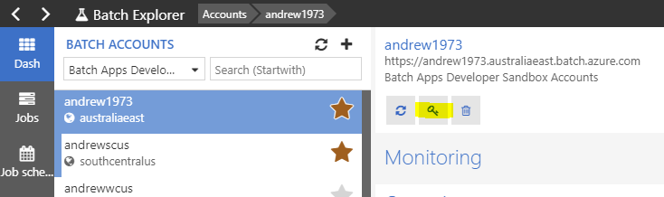
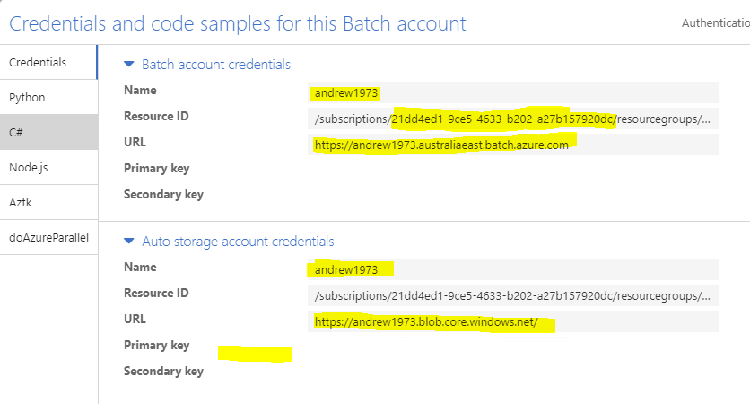
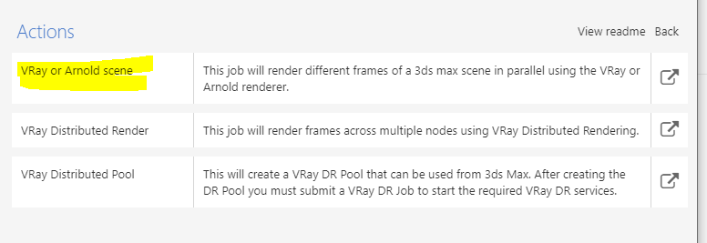
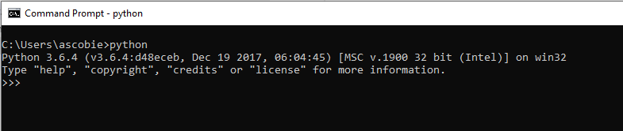
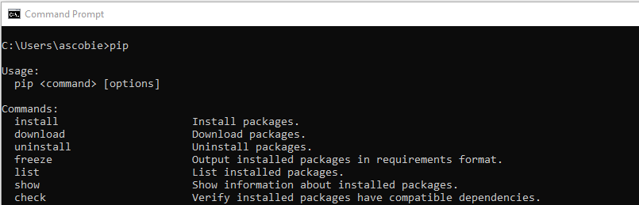

Process job manifest
====================

This document outlines how to setup and run multiple rendering jobs from
a JSON manifest file using the process_manifest.py Python script. The
Python script uses the Azure Batch Extensions Python SDK to submit
multiple NCJ (no code jobs) template jobs that have been defined in a
JSON manifest file. Each job is defined with enough information to
submit it to the Batch service for processing.

Prerequisites
-------------

- Python 3.6 or higher

- PIP (would usually be installed with Python)

- Python added to the windows path.

- Job and parameter template. The default template is the standard 3ds
    Max template and is included in the "./templates/3dsmax-std" folder.
    The rest of the out-of-the-box templates we support are located in
    our GitHub repository:
    <https://github.com/Azure/BatchExplorer-data/tree/master/ncj>. If
    you would like a hand to get another template working with the
    runner, drop me an email at: <andrew.scobie@microsoft.com>

- An Azure Active Directory service principal. Details on how to
    create one of these is below.

Creating an Azure Service Principal
===================================

The runner uses a service principal to connect to your Batch account and
submit jobs on your behalf. You need to add the service principal to
your Batch and Storage accounts as a user with the "Contributor" role.

To set up a new service principal, go to this URL:
<https://shell.azure.com/powershell>, and log in with the same user that
you would login to the Azure Portal: <https://portal.azure.com>. After
it has initialized you will be presented with a command prompt.

Change the <subscription-id> and <sp_name> placeholders to be your
subscription ID and the name you want to give the service principal.
Give it a memorable name as you will need to find it later. The name
cannot contain spaces and can contain only alphanumeric characters and
'-' hyphens. Then copy the commands into the command prompt, either one
line at a time or all at once.

```
az account set --subscription "<subscription-id>"
$sp = az ad sp create-for-rbac --name <sp_name> --years 1
az role assignment create --assignee ($sp | ConvertFrom-Json).appId --role Reader 1> $nul
az role assignment delete --assignee ($sp | ConvertFrom-Json).appId --role Contributor 1> $nul
```

Now enter the command **$sp** and press enter. You will be presented with
the content of the service principal object. Copy the AppID, Password,
and Tenant. These go in the manifest file as the
"servicePrincipalClientId", "servicePrincipalSecret",
"servicePrincipalTenant" settings, respectively.

Add the Service Principal to your Batch account
-----------------------------------------------

Log into the Azure portal at: <https://portal.azure.com> and find your
Batch account. Go to the Batch account details page and then click on
the "Access control (IAM)" menu item.

Click on "Add role assignment"



In the left hand role assignment form, select the role of "Contributor",
leave the "Assign access to" as the default "Azure AD user, group, or
service principal", and enter the name of the service principal in the
"Select" input box.



Once the service principal has been found and loaded, click on it, it
will move to the "Selected members" section in the form, then click on
the "Save" button at the bottom of the form. That's it, your service
principal has now been assigned to your Batch account and can submit
jobs on your behalf.

Now we need to repeat this exact same process for your storage account.
Go to the "Storage accounts" in the far-left menu. There is also a
"Storage account" menu item in the Batch account details page, but this
page only allows you to select and regenerate the security keys. Once
you have selected the storage account that is associated with your Batch
account, click on the "Access control (IAM)" menu item from the storage
account details page.

Repeat the exact process above to add the service principal as a
contributor to the storage account.

Manifest file
=============

The JSON manifest file is defined in four sections as follows:
```json
{
    "auth": {
        "batchAccName": "<batch-account-name>",
        "batchAccUrl": "<batch-account-url>",
        "batchAccSub": "<batch-account-subscription-id>",
        "storageAccName": "<storage-account-name>",
        "storageAccUrl": "<storage-account-url>",
        "storageAccSharedKey": "<storage-account-shared-key>",
        "servicePrincipalClientId": "<service-principal-client-id>",
        "servicePrincipalSecret": "<service-principal-secret>",
        "servicePrincipalTenant": "<user-tenant>"
    },
    "settings": {
        "jobTemplateFilePath": "<path-to-job-template-file>",
        "jobParametersFilePath": "<path-to-job-parameters-file>",
        "parameterMapperPath": "<path-to-parameter-mapper-module>",
        "parameterMapperDef": "<method-definition-name>"
    },
    "pool": "<optional pool-name>",
    "jobs": [
        {
            "jobId": "<job-id>",
            "container": "<storage-container-name>",
            "sceneFile": "<scene-file-blob>",
            "frameStart": <start-frame-number>,
            "frameEnd": <end-frame-number>
        },
        …
    ]
}
```

The sections of the manifest file are outlined below.

Populate the Auth section of the manifest file
----------------------------------------------

This section contains the authentication settings for running the job.

- "**batchAccName**" -- Name of the Batch account on which the run the
    jobs.

- "**batchAccUrl**" -- Full URL to the above Batch account including
    the region.

- "**batchAccSub**" -- Subscription ID that contains the above Batch
    account.

- "**storageAccName**" -- Name of the Azure storage account that is
    linked to the above Batch account.

- "**storageAccUrl**" -- URL to the storage account without the
    trailing slash.

- "**storageAccSharedKey**" -- Primary access key to the storage
    account. I hope to remove the requirement for this key in a future
    version.

- "**servicePrincipalClientId**" -- Client ID of an Azure service
    principal that we will use to submit jobs on behalf of.

- "**servicePrincipalSecret**" -- Secret that is defined in the Azure
    service principal.

- "**servicePrincipalTenant**" -- ID of the tenant where the Azure
    service principal is defined. This will be the same tenant ID where
    your Batch account Subscription lives.

You should now have a service principal has been given access to your
Batch and storage accounts, so we can now grab the rest of the settings
required. You should already have the Client ID, Secret, and Tenant ID
from the service principal creation process and you can add these to the
manifest now if you have not already done so.

The rest of the values can be retrieved from Batch Explorer. Open Batch
Explorer and select the correct Batch account. Click on the "Credentials
and code samples" button in the account details page:



Here you will find the rest of the values you need for the manifest
file:



For security purposes I have removed my account keys from this image,
but yours will be here.

Copy the Batch account name, the highlighted subscription ID, and the
URL into the "batchAccName", "batchAccSub", "batchAccUrl" properties in
the manifest file.

Then copy the storage account name, the URL (remove the trailing /
slash), and the primary key, into the "storageAccName", "storageAccUrl",
"storageAccSharedKey" properties in the manifest file.

Populate the Settings section in the manifest file
--------------------------------------------------

The settings section provides the runner with the appropriate job and
parameter template files for submitting your jobs.

- "**jobTemplateFilePath**" -- Path on disk to the job template
    definition file.

- "**jobParametersFilePath**" -- Path on disk the job parameters file
    that goes with the job template.

- "**parameterMapperPath**" -- Path on disk to a Python module that
    defines a method for mapping the template parameters.

- "**mapperModuleName**" -- Name of the module that the runner will
    call to map the job parameters to the template definition. This is
    the name of the file minus the extension.

By default, the runner ships with a basic 3ds Max job template and
parameter file. It also contains the location of a Python parameter
mapper script that the runner uses to get the property values from the
job definition into the job template. As the runner can support any job
template, we cannot know the names of the parameters in the JSON
template, so this provides a mechanism for the end-user to provide a
mapping function to take the job data and map it to the parameter file.

The location of these files will be dependent on where you installed the
runner folder to.

Change the file path of the "jobTemplateFilePath",
"jobParametersFilePath", and "parameterMapperPath" to point to the
correct location of the appropriate files on disk. Note that the JSON
format requires that \\ backslash characters are escaped with a second
backslash, so the path separators will be \\\\.

The "mapperModuleName" setting is used to load the parameter mapper
module at runtime. This must be the name of the file without the file
extension. So, for "parameter_mapper.py", it needs to be
"parameter_mapper".

Populate the Pool section of the manifest file
----------------------------------------------

The pool section is entirely optional. Should you wish, you can put the
name of the pool in here, but most likely you should leave it blank and
pass the pool name in via the command line parameters.

- "**pool**" -- The name of the pool onto which the jobs will be
    submitted.

The pool must already exist in your configured Batch account. The pool
needs to be created with standard 3ds Max pool template:



Set the renderer in the pool configuration to be "vray".

Populate the Jobs section of the manifest file
----------------------------------------------

The jobs section defines an array of jobs. There is intended to be no
real limit to the number of jobs that can be defined in this section.
But the user should exercise caution that an appropriate "active job"
quota has been defined on the Batch account as the default is set to 20.
Also monitoring a very large number of active jobs can involve its own
issues.

Each job definition consists of the following properties:

- "**jobId**" -- The unique identifier of the job. The job ID can
    contain any combination of alphanumeric characters including hyphens
    and underscores. At present, the job will not be submitted to the
    service should an existing job be found with the same identifier.

- "**container**" -- The name of the storage container that contains
    the pre-uploaded assets. The container name can contain any
    combination of *lowercase* alphanumeric characters including single
    hyphens. The container name must start with the "*fgrp-*" container
    name prefix as the Batch Extensions SDK requires that file groups
    are prefixed in this way. This requirement should be relaxed in
    future versions of the SDK.

- "**sceneFile**" -- The name of the scene file in the container.
    Should the scene file exist in a sub directory, the format is:
    {folder-name}/{scene-file}.

- "**frameStart**" -- The number of the first frame to render.

- "**frameEnd**" -- The number of the last frame to render.

The job definition can be expanded to add in new properties should they
be required. In a future release I would like to add a generic key/value
pair collection to expand on the basic settings that currently exist. A
future version of the runner will be able to define a folder of assets
to upload.

Installing the runner
=====================

The runner can be installed by unzipping the contents to a local
directory. The zip archive consists of several Python files and a folder
containing the default 3ds Max templates and parameter mapper. The main
entry file is called process_manifest.py.

Make sure that Python is included in your windows path environment
setting. This way you can run the "python" command from anywhere. To
test this, open a CMD window and type "python", should everything be set
up correctly you will see an output from the python application.



Pressing CTRL+Z keys followed by the enter key will exit you from the
program.

Check that PIP it installed by entering "pip" to the command line:



PIP would normally be installed with Python, but this is not always the
case as it can be deselected from the installer. Should you get a
command not found when trying to run PIP, you need to install. The
following web page gives you information about how to do this:

<https://stackoverflow.com/questions/4750806/how-do-i-install-pip-on-windows>

After confirming you have PIP installed, from a CMD window, navigate to
the directory containing the process_manifest.py script file, then
type:

```
pip install -r setup/requirements.txt
```

This will install the Azure Batch and Azure Batch Extensions Python
SDKs. Should this step not work, get in touch with us with the given
errors.

That should be it.

Executing the runner
====================

Make sure all the auth, and settings, values are set in the manifest and
add a simple job to the job definition collection in the template.

The runner has several input parameters defined:

**--manifest**\
This is the path to the manifest file.

**--operation**\
The operation type, either "run" or "test"

**--pool**\
The name of the pool, optional if running in test mode.

Test mode
---------

The runner can be executed in "test" mode. Running in test mode will
confirm that any job defined in the manifest is valid and able to be
submitted to the Batch service. It checks that there are no existing
jobs with the specified identifier and that the storage container and
scene file does exist at the specified location.

To test the manifest, make sure the CMD prompt is in the correct
directory and execute the following command:

```
python ./process_manifest.py --operation test --manifest "<path-to>\\manifest.json"
```

This will test that the job or jobs defined in the manifest can be
submitted to the Batch service. You will see some logging around
application setup and various paths and setting, then you will see:

```
### operating in 'TEST' mode, no jobs will be submitted ###
testing job: my-test-job - scene file: water.max, container: fgrp-3ds-max-vray, folder: None
PASS :: job does not already exist
PASS :: container and scene file exists
exiting application normally
```

In this case the manifest can be submitted as the job is unique and the
container and scene file are where they should be.

Changing the manifest to include a job ID that already exists in my
Batch account and a scene file that cannot be found would result in an
output like the following:

```
WARN :: job with id 'holiday-animation-all' already exists. Job definition cannot be submitted.
WARN :: container 'fgrp-3ds-max-vray' and or scene file: 'does-not-exist.max' does not exist. job definition cannot be submitted.
```

If you see warnings like this from your tests, then you will need to fix
up the manifest file.

Run mode
--------

When in "run" mode, the runner will submit jobs to the Batch service
into the nominated Batch account and pool.

A typical command to submit jobs in run mode would be:

```
python ./process_manifest.py --operation run --manifest "<path-to>\\manifest.json" --pool my-pool
```

This will take each job in the manifest, apply the parameters to it, and
submit the job via the Python Batch Extensions SDK.

While the script is executing you will see various setup log entries as
was with the test scenario, but you will now see logging around
parameter logging and job submission:

```
### operating in 'RUN' mode ###
loading parameter mapper module:  D:\_sandpit\_rendering\max-submit\templates\3dsmax-std\parameter_mapper.py
about to submit '1' jobs to 'https://andrew1973.australiaeast.batch.azure.com'
configuring job with identifier: 'water'
got container_sas:  https://andrew1973.blob.core.windows.net/fgrp-3ds-max-vray?SAS 
mapped parameters:  {'jobName': {'value': 'water'}, 'poolId': {'value': '3ds-max-vray-rendering-d4-v2'}, 'maxVersion': {'value': '2019'}, 'renderer': {'value': 'vray'}, 'inputFilegroup': {'value': '3ds-max-vray'}, 'inputFilegroupSas': {'value': 'https://andrew1973.blob.core.windows.net/fgrp-3ds-max-vray?SAS '}, 'sceneFile': {'value': 'water.max'}, 'outputName': {'value': 'image.jpg'}, 'additionalArgs': {'value': ' '}, 'jobPriority': {'value': 1}, 'frameStart': {'value': 0}, 'frameEnd': {'value': 0}, 'outputs': {'value': 'outputs'}}
submitting job to batch extensions client:  water
exiting application normally
```

You may see some logging like the following when jobs are being
submitted:

```
The specified container already exists. ErrorCode: ContainerAlreadyExists
```

This is OK, the Batch Extensions SDK is logging this to standard out
when it should be ignoring it as it is an entirely expected scenario.
They know about it and it will be fixed in the next release.
