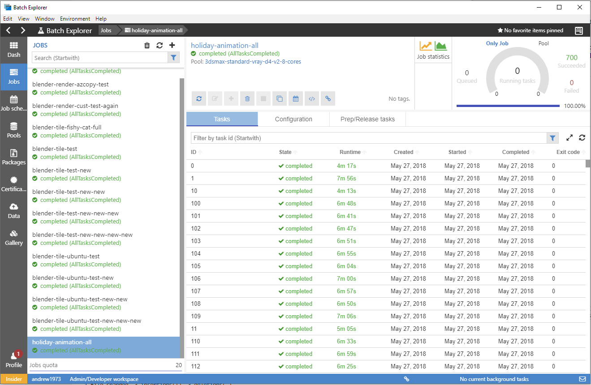

# Azure Batch Rendering
BatchExplorer plugin for 3ds Max. This plugin allows you to use BatchExplorer and the Azure Batch Rendering Service to render your scenes in the cloud.

## BatchExplorer
BatchExplorer is a tool to manage your Azure Batch accounts. The goal is to implement a great user experience that will help you debug, monitor and manage your pools, jobs and tasks. It also includes new features such as `Job and Pool Templates` with the aim to improve your Batch experience. BatchExplorer is updated monthly with new features and bug fixes. You can download it for Windows, Mac OS, and Linux from the [BatchExplorer website](https://azure.github.io/BatchExplorer/).



## Installing the plugin
These steps will outline how to install and use the 3ds Max plugin.

#### 1. Install BatchExplorer
Install the latest version of BatchExplorer from the [BatchExplorer website](https://azure.github.io/BatchExplorer/).
This is the tool that will do the majority of the work to get your Blender scenes rendering in the cloud. We also have an
[insider build of BatchExplorer](https://azure.github.io/BatchExplorer/insider.html) that is deployed from our continuous deployment
system and has the most recent code pushes.

**Note: Once installed, please login to BatchExplorer and select the Batch Account you wish to submit jobs to. This will assist you later when you launch BatchExplorer from the plugin later.**

#### 2.1 Install the 3ds Max plugin
Download the latest zip file from the releases folder.

3ds Max 2016 zip is here: [max-2016-plugin.0.1.0.zip](https://github.com/Azure/azure-batch-rendering/raw/master/plugins/3ds-max/release/2016/max-2016-plugin.0.1.0.zip).

3ds Max 2017 - 2019 zip is here: [max-2019-plugin.0.1.0.zip](https://github.com/Azure/azure-batch-rendering/raw/master/plugins/3ds-max/release/2018-2019/max-2019-plugin.0.1.0.zip).

Once the zip has downloaded, you need to unlock it by right-clicking on the zip file and selecting properties:


When unlocked you can extract the files and copy them to: ```C:\Program Files\Autodesk\<<version>>\bin\assemblies```

Restart 3ds Max. There will be a new menu option for Azure Batch Rendering.

## Using the plugin
The 3ds Max plugin gives you 4 menu options. It can be accessed via the ```Azure Batch Rendering``` menu.


**Monitor your jobs** - Takes you to your jobs dashboard in BatchExplorer.

**Monitor your pools** - Takes you to your pools dashboard in BatchExplorer.

**Manage your job data** - Will take you to the view in BatchExplorer where you can view any data you have uploaded for a job, or any job outputs in Azure Storage.

**Submit a job** - Opens a dialog that allows you to set up and submit a job to the Azure Batch service in the cloud.

## Submit a job

Clicking on the submit job menu item will load a dialog that will contain all of the settings for the job. Some of the values will be pre-populated with information taken directly from the scene file.


**Note:** on open, the submission dialog will scan the scene for assets and any that are missing. Depending on the size of the scene and then number of assets, this can sometimes take a while.

### Job details section

These are the main details about the job:

**Job ID** - The name of the job. This is pre-populated, but you can change it should you wish.

**Template** - There are 3 types of 3ds Max pre-defined templates:

VRay or Arnold Scene - Standard and most common template. This template will render different frames of a 3ds Max scene in parallel using the VRay or Arnold renderer.

VRay Distributed Render - This template will render frames across multiple nodes using VRay Distributed Rendering

**Frame start and end** - The first frame to render in the sequence to the last. To render a single frame, keep these numbers the same.

**Frame width and height** - Will default to the width and height settings of the scene, but you can override it should you wish.

**Renderer** - Select either Arnold or VRay. This will pre-select based on the scene data.

**Additional args** - Any additional arguments you would like to send to the command line, e.g. -superBlack:1.

### Scene details section

These are the main details about the scene:

**Max file** - This is the 3ds Max scene file, used to pass to the command line of the task.

**Asset folders** - Any folders we found when parsing the assets will be here. You can add further directories by right-clicking on the list and selecting ```Add Folder```. The context menu will also allow you to remove a folder, or select the parent of any listed folder.

**Missing assets** - Lists any assets that we cannot find on disk. Any files listed here do not have a known location. Right-clicking on any missing file and select ```Locate Missing File``` to find it.

Once completed, you can click on the ```Submit Job``` button. If any required fields are empty, or the scene is still being parsed, the button will be disabled.

When you click on the submit button, the job details will be sent to BatchExplorer for processing.

## Final Submission

Once you have clicked ```Submit Job``` and the job has been sent to BatchExplorer, the UI will default to the upload data section. Here it will either create a new file-group for your assets, or reuse an existing one should you submit the same job multiple times.


Click upload and close, and the files will be uploaded into storage. Once completed the upload form will close, and the main job submission form will be displayed.


All you need to do now, is to select a pool and set an outputs container, if no pool exists then click on the ```Create pool for later use``` button to create one. None of your settings will be lost. Once the pool is creating you will be redirected back to this page to continue submitting the job.

Scroll to the bottom of the form once you have selected the correct pool: 


Select an ```Output filegroup```, then click on the green button to submit your job to Azure.

Do not select the same container that we created for your input files as your outputs container. You should always have a separate container for job outputs. I have one container called ```Outputs``` that i use for all of my jobs. Each job uploads files to a unique folder within the container with the name of the job. This way, outputs for a job are easy to find.

And that's pretty much it. If you have any queries or questions. Please get in touch at ```Azure Batch Rendering <rendering@microsoft.com>```, and we will be happy to help you out.
