# Azure Batch Rendering
Batch Explorer plugin for Blender 2.79x. This plugin allows you to use BatchExplorer and the Azure Batch Rendering Service to render your scenes in the cloud.

## BatchExplorer
BatchExplorer is a tool to manage your Azure Batch accounts. The goal is to implement a great user experience that will help you debug, monitor and manage your pools, jobs and tasks. It also includes new features such as `Job and Pool Templates` with the aim to improve your Batch experience. BatchExplorer is updated monthly with new features and bug fixes. You can download it for Windows, Mac OS, and Linux from the [BatchExplorer website](https://azure.github.io/BatchExplorer/).

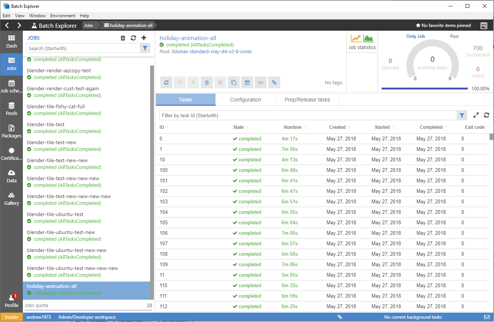

## Installing the plugin
These steps will outline how to install and use the Blender plugin.

#### 1. Install BatchExplorer
Install the latest version of BatchExplorer from the [BatchExplorer website](https://azure.github.io/BatchExplorer/).
This is the tool that will do the majority of the work to get your Blender scenes rendering in the cloud.

#### 2.1 Install the Blender plugin
Download the latest zip file from [the repository](https://github.com/Azure/azure-batch-rendering/raw/master/plugins/blender/blender.client/build/blender-0.2.0.zip).

- Open the Blender application
- Open the user preferences window: ```File -> User Preferences```
- Click ```Install Add-on from File``` button
- Navigate to the plugin zip file you downloaded earlier and select the ```Install Add-on from File``` button.

**Note:** you will need to check the checkbox to enable the plugin.

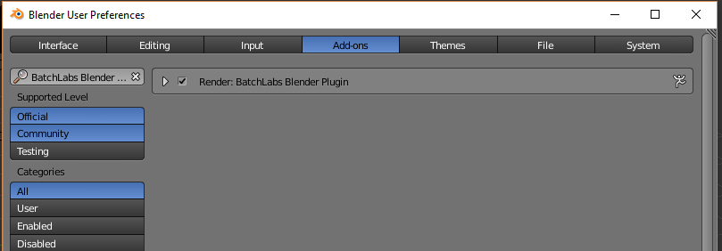

#### 2.2 Set the User Preferences
The plugin contains a couple of handy user preferences.

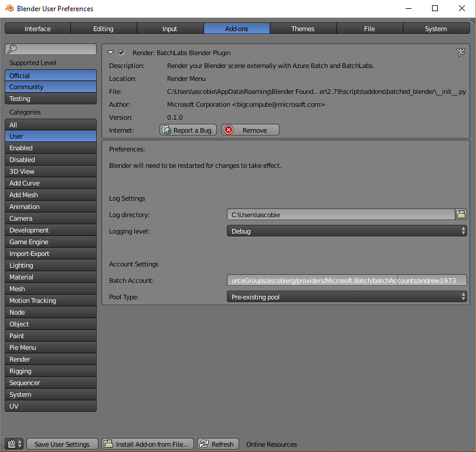

**Log directory** - is where any logs from the plugin will be written to. Note that logs will also be written to the Blender system console that you can view by selecting the following menu: ```Window -> Toggle System Console```

**Log level** - You can set it to ignore basic log messages, but the default of ```Debug``` will be fine as there are not that many logs being generated.

**Batch account** - If you have many Batch accounts and would like the plugin to default to using a single account, you can set the fully qualified resource ID of the account. An example of which would be: ```/subscriptions/<sub-id>/resourceGroups/<resource-group>/providers/Microsoft.Batch/batchAccounts/<account-name>```.

This will ensure that every time you open BatchExplorer from the Blender plugin, it will use this account. Otherwise it will default to the last account you were using in BatchExplorer. You can get the ```resource ID``` from BatchExplorer. Run BatchExplorer and select the account you want to use. From the details screen, select the ```Credentials and code samples``` button. Copy the ```resource ID``` and paste it into the Batch account input box.

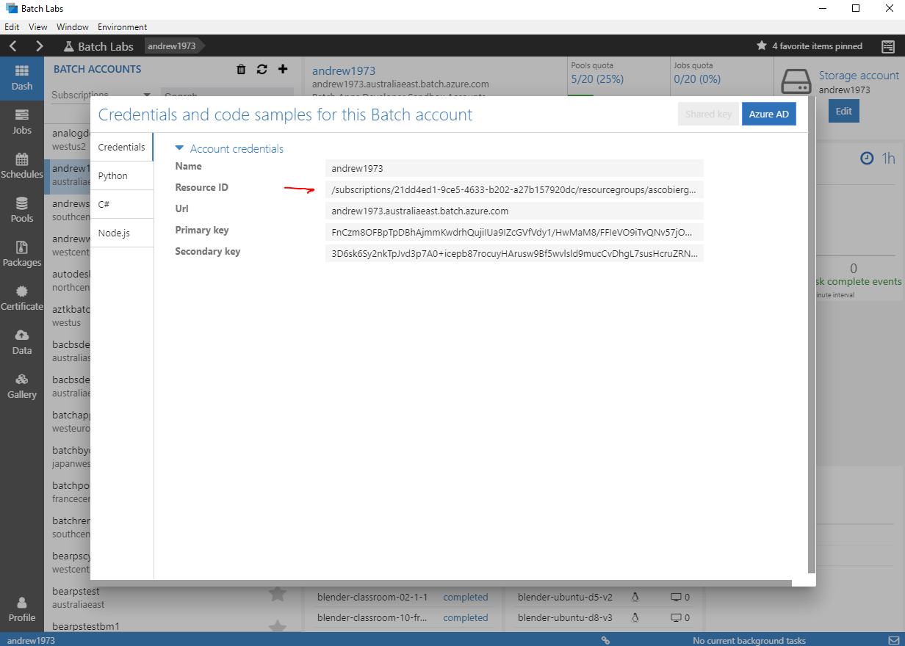

**Pool type** - When submitting a job, you can use a persistent pre-existing pool, or an auto-pool that is created when the job is submitted and then deleted when the job is completed. While auto-pools can be handy, they can also make it hard to diagnose some issues with the job should you have any. It is recommended that while you are rendering your test scenes that you use a persistent pool. Once you are happy with the process you can switch to using an auto-pool should you wish.

## Using the plugin
The Blender plugin gives you 4 menu options. It can be accessed via: ```Render -> Azure Batch Rendering```. All commands take you to the corresponding page in the BatchExplorer application.

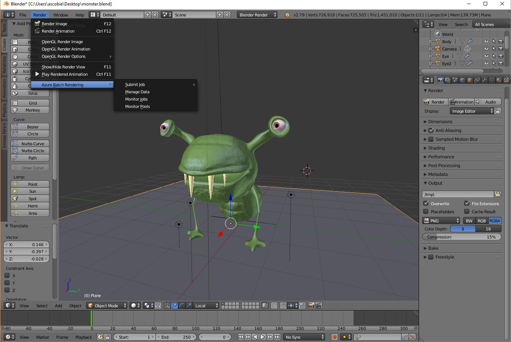

**Submit job** - Allows you to submit a rendering job using our job and pool templating service. It will pre-populate some fields and get you submitting a job in no time with the click of a button. This menu option lists the currently available templates from our [Blender template repository](https://github.com/Azure/BatchExplorer-data/tree/master/ncj/blender). We have full range of Ubuntu 16.04 and Windows Server based templates. Should you have a requirement for any other type of job or pool template, then please let us know and we can look to create one for you. The best place to raise this would be the [BatchExplorer issues register on GitHub](https://github.com/Azure/BatchExplorer/issues).

Currently available templates:

- Render on Linux (Render a Blender scene using Ubuntu 16.04)
- Distributed Render on Linux (Distributed rendering for Blender. Render frame tiles on multiple Ubuntu nodes with the CYCLES rendering engine.)
- Render on Windows Server (Render a Blender scene using Windows Server)
- Distributed Render on Windows Server (Distributed rendering for Blender. Render tiles on multiple Windows Server nodes with the CYCLES rendering engine)
- GPU Render on Windows Server (Render a Blender scene using Windows Server GPU machines and the Blender CYCLES rendering engine)

**Manage data** - Will take you to the screen where you can select and upload your data into a file group so that it can be referenced by your job.

**Monitor jobs** - Takes you to your jobs dashboard.

**Monitor pools** - Takes you to your pools dashboard.

#### 1. Submit your job
Before you submit your job, you'll need to get the latest versions of your scenes input data into a blob storage container. These are called file groups and are used to get your assets onto the compute nodes in your pool so that the tasks in your job can access them. From the ```Render``` menu in Blender, select ```Azure Batch Rendering -> Submit Job -> Render movie on Ubuntu 16.4```. This will take you to the correct location in BatchExplorer and will automatically populate the required data for your Blender scene.

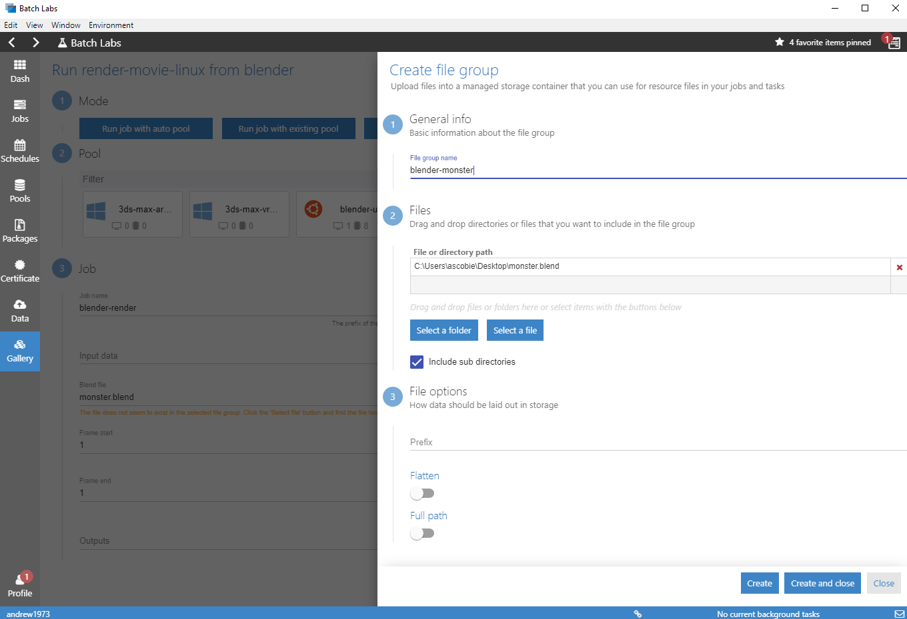

Note that the file group name and ```.blend``` file will have been automatically set. If you have any external asset directories such as characters and textures that you need to be included with the ```.blend``` file, you can drag and drop them onto the path table.

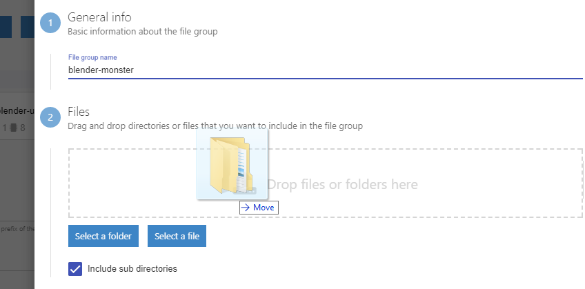

The name of the file group is based on the blend file and can be changed should you wish. Note that running the job from Blender multiple times will use the same file group. This is fine and only those files that have been modified will be uploaded to your file group.

Ensure ```Include sub directories``` is checked. Under File options keep the ```Prefix``` empty, ```Flatten``` and ```Full path``` disabled. Then click ```Create and close```.

At a later time, should you wish to view the files and folders in the file group, you can access this under the main ```Data``` menu and selecting the file group name from the list.

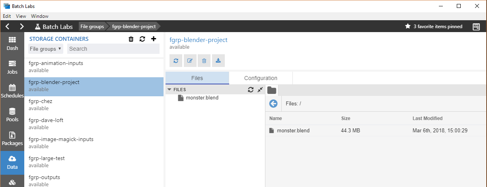

#### 2.1. Create a pool
If you have not created a pool to run your job on, then we can do that now. Rendering jobs need to be run on the correct type of pool. Only a pool that was created with the correct Blender template will work. Click on the ```Create pool for later use``` button and you will see this form:

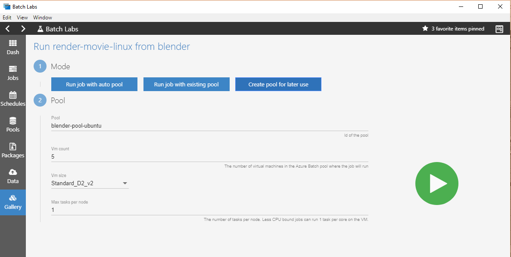

- Enter a pool name, or leave the default which will be: ```blender-pool-ubuntu```.
- Choose the number of compute nodes, the template defaults to 5, but for the sake of an initial test we can use 1 or 2. For very large jobs we can select virtually any number of compute nodes. Any new Batch account will have a default Quota of 20 cores. If you are using 2 core machines, then you can create a pool with up to 10 compute nodes should you wish. Note that you will pay for the time the compute nodes are running. You can send in a support request to have this number increased should you wish. Quota increase requests can be raised from the [Azure Portal Support Page](https://portal.azure.com/?feature.customportal=false#blade/Microsoft_Azure_Support/HelpAndSupportBlade/newsupportrequest)

- Select a compute node size. For this example, we'll use a single ```Standard_D2_v2``` compute node which has 2 cores. You can see more information about the various Azure Compute Node sizes [here](https://docs.microsoft.com/en-us/azure/virtual-machines/windows/sizes).
- Select the ```Max tasks per node```. This is how many simultaneous tasks that can be run on a single compute node. For small, less CPU bound jobs, you can sometimes get away with running 1 task per CPU, but for normal rendering purposes, a single task per compute node would be optimal.

Click on the big green button and your pool will be submitted to the Batch service for creation. Once submitted you will be redirected back to the job details form.

**Note** - Once a pool is created, you don't have to delete it in-between jobs. You can just use BatchExplorer to rescale the pool down to 0 nodes and you will no longer pay for any compute node uptime. Next time you want to run a Blender job, just select: ```Pools -> blender-pool-ubuntu``` and click on the scale button to re-scale the pool up again with new compute nodes. If you contact us we can help you with an auto scale formula that will scale up when new jobs attempt to use the pool, and automatically scale down again once the jobs have completed.

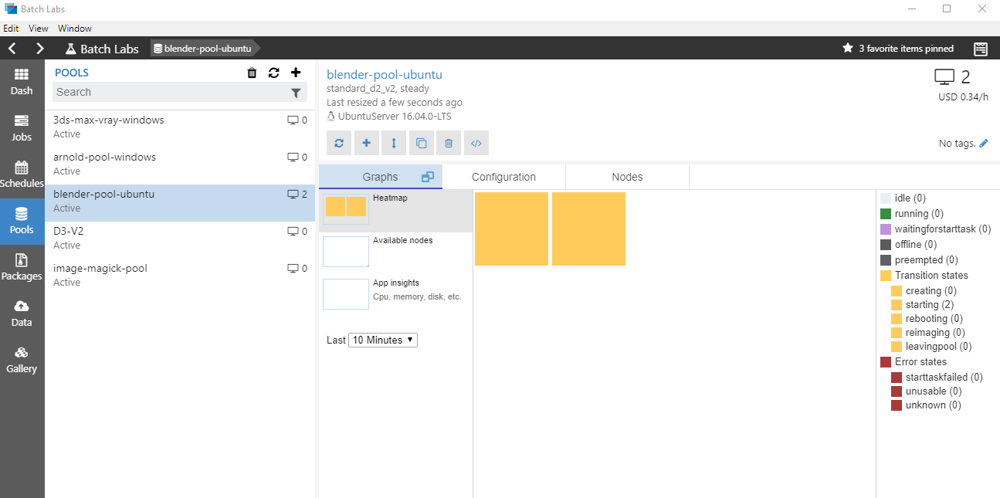

After a minute or so you should see the compute nodes appear in the pool heatmap. The compute nodes will transition from ```Starting -> Waiting for Start Task -> Idle```. The entire process should be done in about 5 - 10 minutes. This can take longer depending on the number and size of machines you requested. We install Blender on each of the compute nodes as they are created which is what is happening in the `Wait for Start Task` state.

There is no reason why you cannot submit a job now, tasks will start to be run as soon as any of the compute nodes become ```Idle```.

#### 2.2. Actually submitting your job
If you were not automatically redirected back to the job details form, click on the ```Run job with existing pool``` button. Any data that was previously entered into the form will still be visible.

From the submit job form, enter the following information:

- If you just created a pool, then it will be automatically selected for you. If not, select an existing pool from the Pool list.
- For the ```Job name```, either keep the default or enter something meaningful. **Note that each job within a given Batch account must have a unique name.** You will get an error should you re-use a job ID more than once.
- The ```Input data``` file group should be already set. If not, then select the ```blender-<scene-file>``` file group that you created earlier. The warning under the ```Blend file``` option should now go away. Note that each file group will now be prefixed with ```fgrp-```.
- The ```Blend file``` should be selected. If not, click on the button and browse to the main ```.blend``` file for your scene.
- ```Frame start``` and ```Frame end``` can either define a frame range, or you can just enter a single frame number in each to only render that frame. Each frame will have its own task created within the job.
- Select the ```Outputs``` file group. This is a file group that any job outputs will be written to including the logs for the job. I would suggest using a different file group for each of your scenes. You can run the same scene job multiple times using the same file group. This makes it easier to keep track of where your outputs are. Each job will upload files to a folder in the file group named with the ID of the job. To create a new empty file group, select the ```Outputs``` form field and select ```Create a new file group``` from the drop down items. Enter the name of the file group and check the ```Create an empty file group``` checkbox. Then click ```Create and close```. Your empty file group will be created and populated into the form.

**Note:** I would not recommend using the same file group as you used for your scene assets. Output images and log files are uploaded from each of your tasks, if you had used the same input file group for your outputs, the next time you re-ran the job, these outputs would be downloaded to the compute node with the rest of your input files, whereby possibly affecting task runtime performance.

**Example:** Should your ```.blend``` file be called ```my-scene.blend```, your main asset file group would be called ```blender-my-scene```, you can then call your output file group ```blender-my-scene-outputs```. Using this approach will group your input and output file group containers together in the ```Data``` view of BatchExplorer.

Once each form field is completed, the submit button will be enabled and you can click on the green button to submit the job. Once successfully submitted, you will be taken to the job details page where you can view the progress of the job.

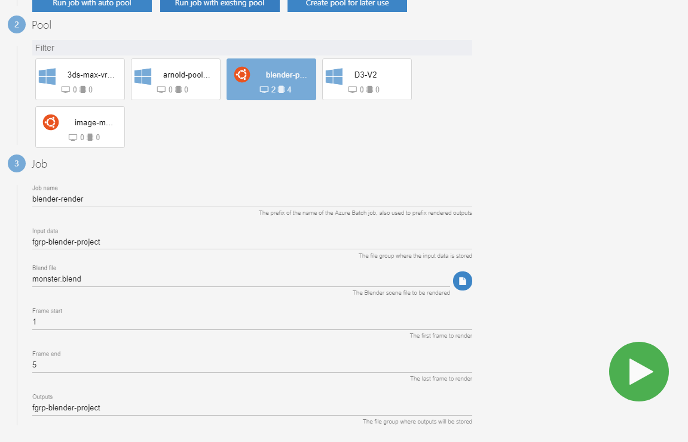

The running task graph in the top right will show you how many tasks are currently running. You might have to click on the refresh button at the top right of the task list in order for the task table to update.

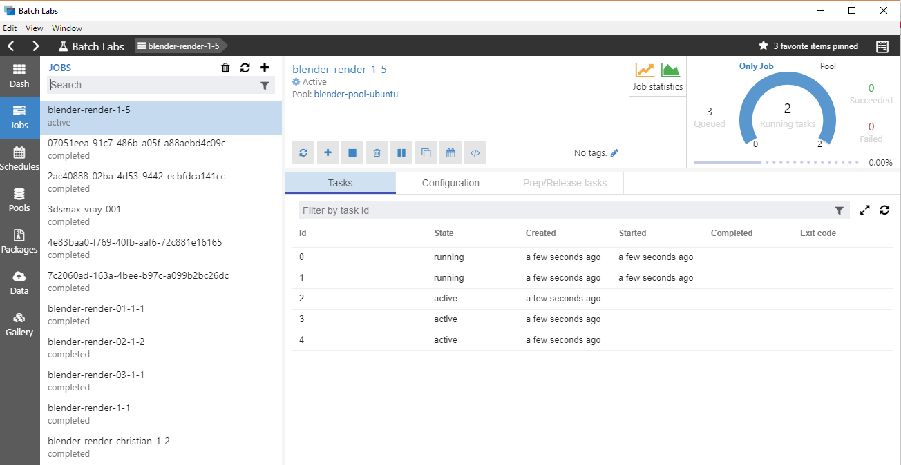

Once completed you can click on any task to look at the details and outputs of that task. Note that as soon as the pool has been scaled down any files on the compute node are no longer available, but any logs and outputs will have also been uploaded to the output file group you specified when you submitted the job.

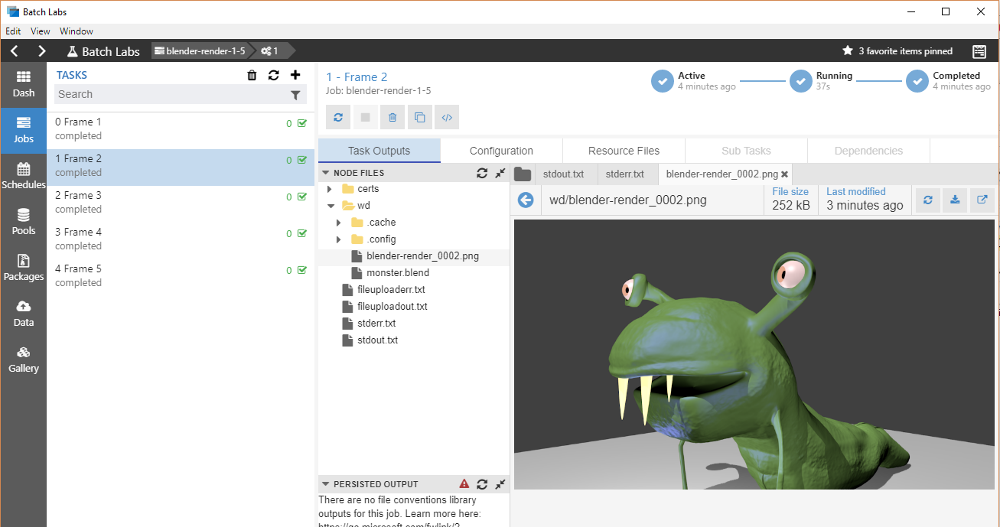

Click on the ```Data``` menu and select the file group you selected for the job outputs to view any outputs that were uploaded for your job.

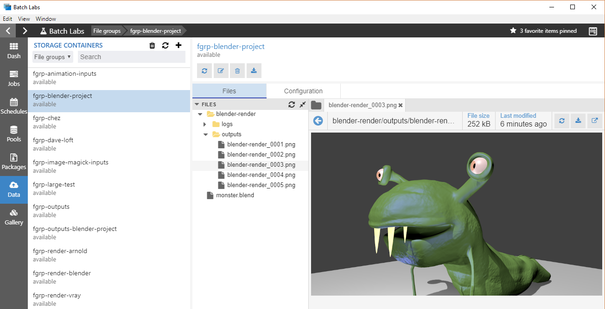

And that's it. If you have any queries or questions. Please get in touch at ```Azure Batch Rendering <rendering [at] microsoft.com>```, and we will be happy to help you out.
